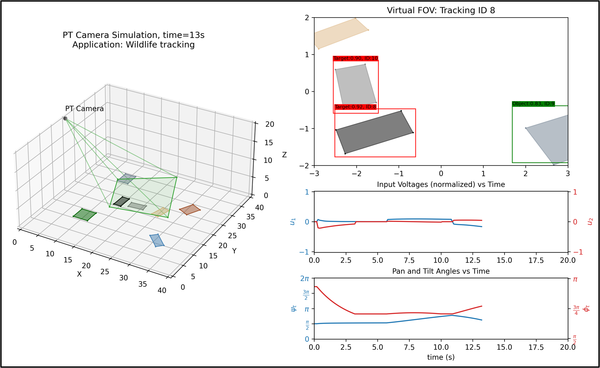
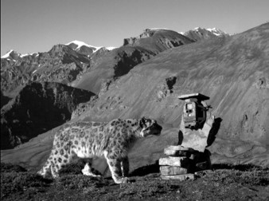
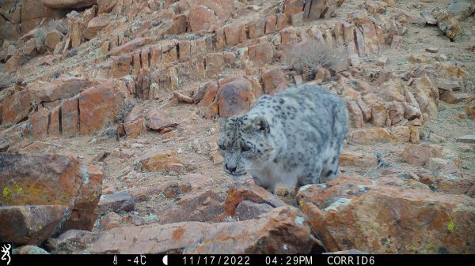

# MAE5810: Robot Perception Final Project

## Introduction

This repository hosts the code for the MAE5810 (Fall '23) final project. The goal of the project was to simulate a PT (Pan-Tilt) camera field of view and implement the following capabilities:

1. Object detection: detect objects in the virtual FOV.
2. Object tracking: follow objects across frames.
3. Object classification: classify objects as static (Object, <span style="color:green">green</span>) or in motion (Target, <span style="color:red">red</span>) w.r.t. the inertial frame.
4. Optimal camera control: control camera inputs to keep a target within the FOV.

Here is a snapshot of the final simulation that incorporates all these methods:



### Motivation

This project was inspired by wildlife conservation efforts that involve monitoring the endangered Snow Leopard population in Central Asia (see The Snow Leopard Conservancy [1]). With an estimated population of 4,000 to 6,600, Snow Leopards face threats like habitat loss, poaching, and loss of prey [2]. The Snow Leopard Conservancy employs trail cameras for tracking, using digital images to identify individuals via unique pelage patterns. However, integrating intelligent camera control could further enhance monitoring effectiveness, improving target detection and environmental tracking, thus aiding significantly in understanding and conserving Snow Leopards.

<p float="left">
  
  
</p>
 <em><i>Left:</i> Snow leopard and camera trap. <i>Right:</i> Camera trap image. Sourced from [1].</em> 

### Repository Structure
```
project
│   README.md 
│   Final - YOLO Training.ipynb         
|       # Training data generation for object detection.
|   Final - Object Detection.ipynb      
|       # Final simulation generation, with object detection, tracking, classification, and camera control.
|   Object-Detection-YOLOv2-Google-Colab.ipynb      
|       # YOLOv2 training with pretrained weights. Adapted from https://github.com/robingenz/object-detection-yolov3-google-colab.
|   sort.py      
|       # Implementation of the sort algorithm. Adapted from https://github.com/abewley/sort.
|   utils.py     
|       # Classes and methods for setting up and running the simulation.     
│   
└───artifacts
│   │   Final_Project_amo78.pdf        
|   |       # Final project writeup.
│   │   Final_presentation_amo78.mp4    
|   |       # Final presentation in mp4 format.
|   |   PT_camera_simulation_wildlife_16_9_yolo_sort_classify_track_snapshot.png    
|   |       # Tracking simulation snapshot.
|   |   PT_camera_simulation_wildlife_16_9_yolo_sort_classify.gif           
|   |       # Simulation without camera control.
|   |   PT_camera_simulation_wildlife_16_9_yolo_sort_classify_track.gif     
|   |       # Simulation with camera control for tracking.  
│   │   CameraTrap.jpg      
|   |       # Snow leopard and camera trap.
|   |   Claudio-Augugliaro-Mongolia-600x337.jpg      
|   |       # Camera trap image.      
```

## Methods

### 1. Object Detection

* **YOLOv2** (“You Only Look Once”) CNN [3]
    * Single-stage, real-time object detection model for classification and bounding box predictions.
    * Despite more advanced YOLO models, YOLOv2 was chosen for the project due to its ideal balance of accuracy and computational efficiency.
* Training: 
    * Generated 740 frames and bounding boxes from 9 different simulations. Used ~490 for training, ~250 for testing.
    * Started from pre-trained weights to decrease training time.
    * Trained on Google Collab with a T4 GPU (because I don’t have a GPU) for ~3 hours/3000 iterations. 
    * Training data can be found [here](https://drive.google.com/drive/folders/1lB7J55Bz9qjPu7lCM1MnuSXWBN6Cnj6N?usp=drive_link). 

### 2. Object Tracking 

* **SORT** (“Simple Online and Realtime Tracking”) [4]
    * Next frame prediction using a Kalman filter.
    * Prediction - object association using the IOU metric.
    * Assignment optimized using the Hungarian algorithm.
    * Simple and efficient, but does not handle occlusions and objects returning to the FOV. 

### 3. Object Classification

* Kinematic matching in the inertial frame
* Threshold classifier (e.g. classify as moving target if inertial velocity $v\geq 0.2 units/frame$).

### 4. Camera Control

* Map velocity in the inertial frame to camera controls $\dot{\textbf{x}}_T\mapsto [\dot{\psi}, \dot{\phi}]$
* Require the projection of virtual FOV center to kinematically match the target object.
* Incorporate camera constraints. 


For more details, see `artifacts/Final_Project_amo78.pdf` and `artifacts/Final_presentation_amo78.pdf`

## Results

### Monitoring simulation. No camera control. Goal: cover as much of the workspace as possible in the simulation time frame.


### Tracking simulation. Intelligent camera control. Goal: identify target and track until it leaves the workspace. Repeat. 


## References

[1] Snow leopard conservancy. https://snowleopardconservancy.org/. Accessed: 2023-10-12.

[2] T. McCarthy, D. Mallon, R. Jackson, P. Zahler, and K. McCarthy. Panthera uncia. IUCN Red List of Threatened Species, 2017.

[3] Joseph Redmon and Ali Farhadi. Yolo9000: better, faster, stronger. In Proceedings of the IEEE conference on computer vision and pattern recognition, pages 7263–7271, 2017.

[4] Bewley, Alex, et al. "Simple online and realtime tracking." 2016 IEEE international conference on image processing (ICIP). IEEE, 2016.


